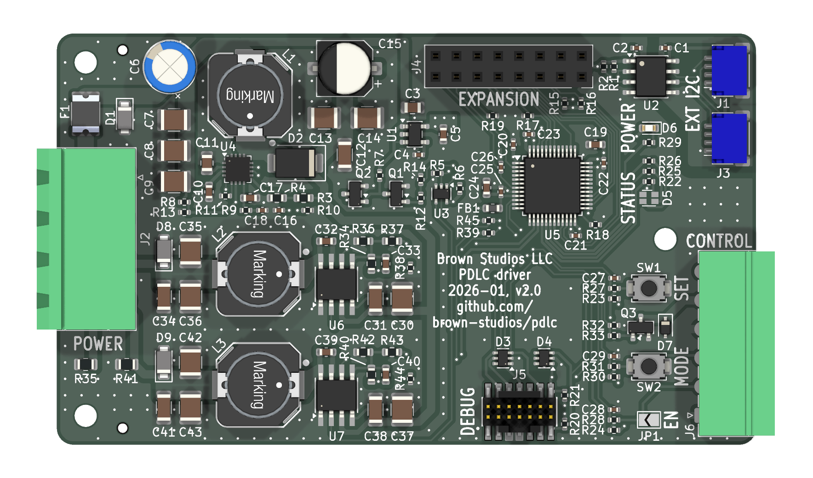
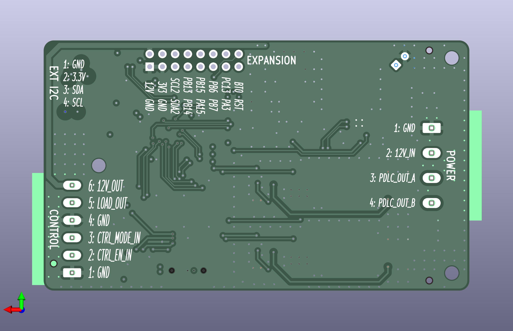

# PDLC driver v2

**Status: In development**

## Design synopsis

The driver has the following major components:

- [LM5158](https://www.ti.com/lit/ds/symlink/lm5158.pdf) boost converter produces high voltage DC at 300 mA
- Two [LMR38010](https://www.ti.com/lit/ds/symlink/lmr38010.pdf) buck converters produce variable voltages for each AC leg
- [STM32L151C8T6](https://www.st.com/resource/en/datasheet/stm32l151c8-a.pdf) microcontroller generates waveforms and monitors control signals
- [ISO1640](https://www.ti.com/lit/ds/symlink/iso1640.pdf) galvanically isolates the external I2C bus when connected to other equipment
- [LP2985-33](http://www.ti.com/lit/ds/symlink/lp2985.pdf) LDO powers the logic circuits at 3.3 V
- Circuit protection elements
  - Supply: 2 A polyfuse, TVS, UVLO battery saver
  - PDLC: undervoltage, overcurrent hiccup, short-circuit, bleed resistor, TVS, power good sequencing
  - Switch inputs: ESD diodes
  - I2C bus: galvanic isolation

[View the schematics in PDF format](pdlc.pdf)

## Circuit board

## Details

### High voltage boost converter ([LM5158](https://www.ti.com/lit/ds/symlink/lm5158.pdf))

The high voltage boost converter raises the voltage from the supply to the intermediate high voltage DC needed to drive the PDLC panels.

This circuit was initially modeled in TI WebBench with the following parameters:

- Vin_min: 11 V
- Vin_max: 16 V
- Vout: 65 V
- Iout_max: 300 mA
- Ambient temperature: 30 C
- Hiccup protection: enabled
- Spread spectrum: enabled
- UVLO: not applicable (the tool can't calculate values in the necessary range, see below)
- Switching frequency: 1.6 MHz
- Soft start time: 16 ms

Resulting performance at Vin = 12 V, Iout = 0.3 A

- Total power dissipation: 0.9 W
- Efficiency: 95.6%

The design was then modified as follows:

- Selected a small format 10 mm x 10 mm shielded drum core inductor: 15 uH Wurth 7447714150 in WE-PD 1050 package.
- Selected X7R/X7S MLCC capacitors with relatively small DC bias derating at the operating voltage based on the manufacturer datasheets.
- Selected UVLO resistors with more common values.  Refer to [calc.py](./calc.py) for the calculations.
- Selected feedback resistors with more common values, Rfb_t = 330 K, Rfb_b = 5.1K.  So Vout = 1 V * (Rfb_t / Rfb_b + 1) = 65.7 V.
- Added bulk capacitors to the input and output.
- Optimized part selection for cost and availability at JLCPCB.  Unfortunately, the 22 uH inductor used in the previous design (with a lower switching frequency) was out of stock so 15 uH was used (at a higher switching frequency) instead.

### Variable voltage buck converters ([LMR38010](https://www.ti.com/lit/ds/symlink/lmr38010.pdf))

The two variable voltage buck converters modulate the high voltage DC to produce AC with waveforms driven by a DAC.  This design is modeled on the SDAA033 document reference (see below) with some changes to the underlying assumptions.

- Unlike SDAA033, this design does not assume that the waveform is sinusoidal as some sources suggest that an AC square wave may yield better clarity in the PDLC film and it would be nice to experiment with non-sinusoidal waveforms while still ramping the voltage to limit capacitive in-rush current: in other words, increase the slew rate for rise-and-fall, and inject a hold time in between.  It may therefore be inaccurate to estimate power dissipation at the Vrms operating point.  Once the PDLC film charges to the applied voltage, its current draw should be determined by its parasitic resistance (assumed to be somewhat large) and the buck converter should enter the PFM mode where it skips pulses due to low current demand from the load.  The total energy transferred should be similar regardless of the shape of the waveform although a faster slew rate implies that high voltage boost converter must supply more current and will dissipate more power during the ramp.
- The selected LMR38010 switch Rds_on is about 3 times larger than the LM65635 considered in SDAA0033 so its switching losses are greater.  Unfortunately those LM656xx high performance parts were not readily available at JLCPCB at the time of this design and the few that were cost 10x as much.  The LMR38010 also has a higher input voltage of 80 V instead of 65 V which increases the margin for this application.
- LMR38010 and LMR38020 are pin-equivalent and only differ by their overcurrent thresholds.  We choose LRM38010 which has a 1 A rating because the high-side overcurrent protection limit of 1.6 A allows the use of smaller inductors with a lower DC current rating.  Thus the selected inductor's Isat must be greater than 1.6 A to prevent the inductor from entering saturation.  Curiously, LMR38010 costs a little more.  The LMR38020 data sheet is a bit richer and provides additional useful formulas and tables that should apply to both parts.
- The LMR38010 data sheet recommends setting Iout_max to the full device current rating (1 A) during design when the actual load current (300 mA) is much smaller.  Note that choosing a larger Iout_max results in a design with smaller inductors.
- The buck converters may be damaged if the switching node drops below 0 V so we choose Vout_low = 3 V and Vout_high = 63 V to allow a safety margin for generating a 60Vp-p waveform between a pair of buck converters supplied with Vin = 65.7.
- To avoid oversizing the device, we follow the guidance of SDAA033 and set the Vout design operating point to the RMS voltage.  So Vout = (Vout_high - Vout_low) / sqrt(2) + Vout_low = 45.4 V.

This circuit was initially modeled in TI WebBench with the following parameters:

- Vin_min: 65.7 V
- Vin_max: 65.7 V
- Vout: 45.4 V
- Iout_max: 1 A
- Ambient temperature: 30 C
- Switching frequency: 500 kHz
- UVLO: not applicable
- Output cap type: ceramic
- Power good resistor: open

The design was then modified as follows:

- Selected a small format 10 mm x 10 mm shielded drum core inductor: 68 uH Wurth 7447714680 in WE-PD 1050 package.
- Selected X7R/X7S MLCC capacitors with relatively small DC bias derating at the operating voltage based on the manufacturer datasheets.
- Selected Rt for the switching frequency.  Noticed that TI WebBench sometimes suggests a value that differs from the formula and tables in the data sheets so made sure to verify it.
- Selected feedback resistors based on the method described in [SLYT777](https://www.ti.com/lit/an/slyt777/slyt777.pdf).  The STM32L151 DAC electrical specifications specify that Vdac is linear in the range of 0.2 V to Vdda - 0.2 V where Vdda = 3.3 V for this application so we choose a margin of at least 0.3 V to stay safely within the linear range.  The buck converter internal feedback voltage reference is Vfb_ref = 1 V and it recommends Rfb_t >= 100 K.  Refer to [calc.py](./calc.py) for the calculations.

Operating points:

| label | Vadj   | Vout     | DAC code |
| ----- | ------ | -------- | -------- |
| 0     | 0.00 V |  69.81 V |        0 |
| min   | 0.20 V |  65.41 V |      248 |
| low   | 0.31 V |  63.01 V |      383 |
| mid   | 1.67 V |  33.00 V |     2076 |
| rms   | 1.11 V |  45.43 V |     1375 |
| high  | 3.04 V |   2.99 V |     3769 |
| max   | 3.10 V |   1.61 V |     3847 |
| Vdda  | 3.30 V |  -2.79 V |     4095 |

## References

### Documents

#### [SDAA033 DC to AC Conversion with DC to DC Buck Converters for PDLC Displays](https://www.ti.com/lit/an/sdaa033/sdaa033.pdf)

Using two buck converters is roughly equivalent to driving an H-bridge through an LC filter (particularly when using synchronous rectification) and uses fewer components.  The buck converter tightly monitors the feedback loop to ensure a stable output voltage under varying load conditions and handle faults which frees the microcontroller to do other work.  This is the model for the design implemented here.

#### [Smart Glass PDLC Film Driver - AN6205](https://ww1.microchip.com/downloads/aemDocuments/documents/APID/ApplicationNotes/ApplicationNotes/Smart-Glass-PDLC-Driver-DS00006205.pdf)

Describes a more traditional PDLC driver based on an H-bridge and LC filter.

#### [An Engineer's Guide to Current Sensing](https://www.ti.com/lit/eb/slyy154b/slyy154b.pdf)

During the design process, I considered adding current sensing to protect against faults in the PDLC film when driving it with an H-bridge.  The [INA381A3](https://www.ti.com/lit/ds/symlink/ina381.pdf) in particular has a comparator output that could be attached to a timer break pin to disable the output quickly and latch until the fault is resolved or it could be used to implement cycle-by-cycle current limiting to more aggressively control the slew rate of the output.  That said, the boost converter PGOOD signal will be deasserted if the output voltage drops too low due to an overload condition or short-to-ground (which cannot be detected by low-side current sensing) so no additional protection seems necessary.

#### [Switch-mode power converter compensation made easy](https://e2e.ti.com/cfs-file/__key/communityserver-discussions-components-files/196/switchingpower_5F00_compensation.pdf)

Describes the theory of designing current control mode compensation networks.

#### [Design Feedforward Capacitor for LMR14020](https://www.ti.com/lit/an/snva798/snva798.pdf)

Describes the choice of a feed forward capacitor for an internally compensated current control mode buck converter.  The design includes a DNP pad in case it is needed.  Typical values are in the pF range.

#### [Control mode quick reference](https://www.ti.com/lit/an/slyt710b/slyt710b.pdf)

A great summary of 15 different switch mode power supply control modes and their behavior.  Useful for comparing buck converter architectures.

#### [AN-1481 Controlling Output Ripple and Achieving ESR Independence in Constant On-Time (COT) Regulator Designs](https://www.ti.com/lit/an/snva166a/snva166a.pdf)

Describes how to generate ripple in the feedback network for COT mode buck converters.

#### [SLYT777 Methods of output-voltage adjustment for DC/DC converters
](https://www.ti.com/lit/an/slyt777/slyt777.pdf)

Describes how to adjust the voltage feedback loop.  Used a DAC for this design.

### Parts

#### Buck converters

Notable qualities:

- Synchronous rectification improves efficiency and low voltage output operation.
- The control mode influences component selection.  Constant on-time (COT) and pulse frequency modulation (PFM) mode require a minimum output ripple and additional components may be needed to generate that ripple in the feedback network.  Current control mode (CC) requires requires tuning a compensation network (unless internally integrated).  Pulse frequence mode (PFM) 
- The configurable soft start input of some devices may potentially be used to adjust the internal voltage reference and thereby modulate the output voltage target instead of injecting a signal into the feedback network.

A selection of parts available at at JLCPCB/LCSC (as of January 2026):

- [LM5012](https://www.ti.com/lit/ds/symlink/lm5012.pdf): 100 V, 2.5 A, non-synchronous (need diode), COT mode (need ripple), light load efficiency
  - LM5012DDAR: $1.19/1ku, SO-8-EP, 4.9 mm x 3.9 mm
- LM5013: 100 V, 2.5 A, similar to LM5012
- [LM5017](https://www.ti.com/lit/ds/symlink/lm5017.pdf): 100 V, 600 mA, synchronous, COT mode (need ripple), no soft-start but the datasheet shows how to implement it by injecting into the feedback network (helpful!), no light load optimization
  - LM5017MRX: $0.51/1ku, SOIC-8-EP, 4.9 mm x 3.9 mm
- [LM5161](https://www.ti.com/lit/ds/symlink/lm5161.pdf): 100 V, 1 A, synchronous, COT mode (internal ripple generation in DCM mode), configurable soft-start, light load efficiency (when DCM enabled), external LDO recommended to drive VCC
  - LM5161PWPR: $1.46/1ku, HTSSOP-14, 5.0 mm x 4.4 mm
- [LM5163](https://www.ti.com/lit/ds/symlink/lm5163.pdf): 100 V, 500 mA, synchronous, COT mode (need ripple), fixed soft-start, light load efficiency (pulse skipping)
  - LM5163DDAR: $0.33/1ku, SO-8-EP, 4.9 mm x 6.0 mm
- [LM5164](https://www.ti.com/lit/ds/symlink/lm5164.pdf): 100 V, 1 A, synchronous, COT mode (need ripple), fixed soft-start, light load efficiency (pulse skipping)
  - LM5164DDAR: $0.38/1ku, SO-8-EP, 4.9 mm x 6.0 mm
- [LM5166](https://www.ti.com/lit/ds/symlink/lm5166.pdf): 65 V, 500 mA, synchronous, COT or PFM mode (need ripple), PFET switch (no bootstrap capacitor needed), configurable soft-start, adjustable current limit
  - LM5166DRCR: $0.85/1ku, VSON-10, 3 mm x 3 mm
- [LM5169](https://www.ti.com/lit/ds/symlink/lm5169.pdf): 120 V, 650 mA, synchronous, COT mode (need ripple), fixed soft start
  - LM5169PDDAR: $1.66/1ku, SOP-8-EP, 4.9 mm x 6 mm
- [LM5574](https://www.ti.com/lit/ds/symlink/lm5574.pdf): 75 V, 500 mA, non-synchronous (need diode), CC mode (need compensation), configurable soft-start (tracking feature), no light load optimization
  - LM5574: $0.85/1ku, TSSOP-16, 5.0 mm x 6.4 mm
- LM5575: 75 V, 1.5 A, similar to LM5574
- [LMR38010](https://www.ti.com/lit/ds/symlink/lmr38010.pdf): 80 V, 1 A, synchronous, CC mode (internal compensation), light load efficiency (PFM mode)
  - LMR38010SDDAR: $0.59/1ku, HSOIC-8, 4.9 mm x 3.9 mm
- [LMR38020](https://www.ti.com/lit/ds/symlink/lmr38020.pdf): 80 V, 2 A, synchronous, CC mode (internal compensation), light load efficiency (PFM mode)
  - LMR38020SDDAR: $0.40/1ku, HSOIC-8, 4.9 mm x 3.9 mm

## Errata

None yet.
